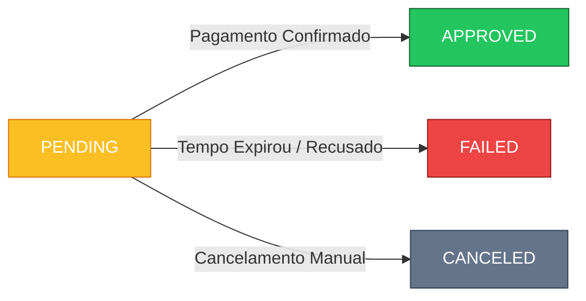

Para garantir a consistência financeira, utilizamos uma máquina de estados rigorosa. Uma transação só pode mover-se em uma direção (ex: de Pendente para Aprovado), nunca retroceder.

## Ciclo de Vida Visual

## Glossário de Status

| Status | Ícone | Significado para Payin (Entrada) | Significado para Payout (Saída) |
| :--- | :---: | :--- | :--- |
| `PENDING` | <Icon icon="clock" color="#fbbf24" /> | Aguardando pagamento do cliente. O saldo **não** está disponível. | Solicitação criada, aguardando processamento bancário. Valor bloqueado. |
| `APPROVED` | <Icon icon="check-circle" color="#22c55e" /> | Pagamento recebido e confirmado. O valor foi creditado no seu saldo. | Transferência realizada com sucesso para a conta de destino. |
| `FAILED` | <Icon icon="circle-xmark" color="#ef4444" /> | Erro no pagamento (cartão recusado) ou boleto/pix expirado. | Falha no envio (chave inválida ou erro bancário). Saldo estornado. |
| `CANCELED` | <Icon icon="ban" color="#64748b" /> | Cobrança cancelada antes do pagamento. | N/A (Saques não costumam ser cancelados manualmente após envio). |

---

## Tratamento de Erros Comuns

<CardGroup cols={2}>
  <Card title="Timeout de Pix" icon="hourglass-end">
    QRCodes Pix expiram em **24 horas** por padrão. Se não pago, o status muda automaticamente para `FAILED`.
  </Card>
  <Card title="Cartão Recusado" icon="credit-card">
    Se o status for para `FAILED` em cartão de crédito, geralmente é falta de saldo ou bloqueio do banco emissor.
  </Card>
</CardGroup>
