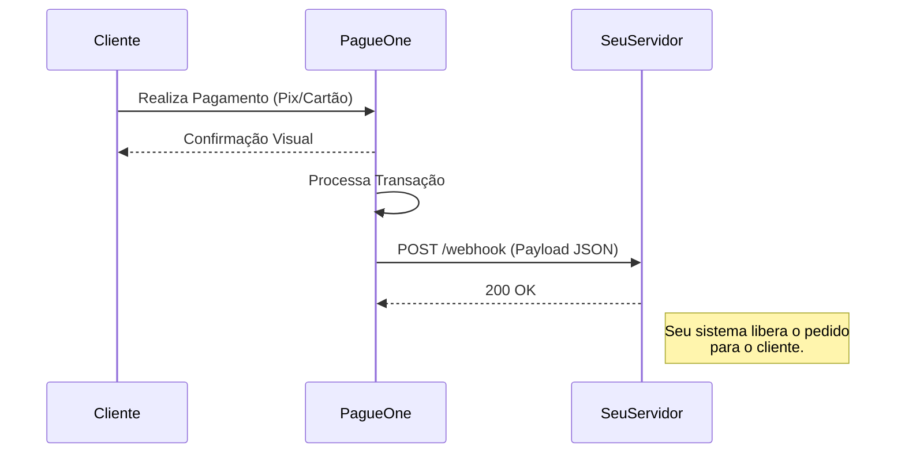

Webhooks são gatilhos HTTP automáticos que enviamos para o seu servidor sempre que algo importante acontece, como quando um Pix é pago ou um saque é processado.

## Como Funciona

<div className="flex justify-center my-8">

</div>

## Configuração

Você deve configurar sua **Webhook URL** no momento de criar a transação (`payin` ou `payout`).

<Warning>
  **Requisito de Confiabilidade:**
  Seu endpoint DEVE responder com **HTTP 200 OK** em menos de 5 segundos. Caso contrário, consideraremos falha e tentaremos reenviar a notificação (retry) exponencialmente.
</Warning>

## Payload de Eventos

### Payin (Pagamento Recebido)

Quando um cliente paga, você recebe este payload:

```json
{
  "event": "PAYMENT_STATUS_CHANGED",
  "data": {
    "id": "550e8400-e29b-41d4-a716-446655440000",
    "referenceId": "pedido_12345",
    "status": "APPROVED",
    "amount": 10050,
    "paymentMethod": "PIX",
    "createdAt": "2023-10-27T10:00:00Z",
    "processedAt": "2023-10-27T10:05:00Z"
  }
}
```

### Payout (Saque Processado)

Quando uma transferência solicitada por você é finalizada:

```json
{
  "event": "PAYOUT_STATUS_CHANGED",
  "data": {
    "id": "a1b2c3d4-...",
    "referenceId": "saque_001",
    "status": "APPROVED",
    "amount": 5000,
    "pixKey": "user@email.com",
    "processedAt": "2023-10-27T14:30:00Z"
  }
}
```

## Exemplo de Implementação

Recebendo o webhook com segurança em Node.js (Express).

```javascript
const express = require('express');
const app = express();

app.use(express.json());

app.post('/webhook', (req, res) => {
  const { event, data } = req.body;

  console.log(`Recebido evento: ${event} para ID: ${data.referenceId}`);

  if (event === 'PAYMENT_STATUS_CHANGED') {
    if (data.status === 'APPROVED') {
      // TODO: Liberar acesso do usuário / Enviar produto
      console.log(`Pagamento ${data.amount} aprovado!`);
    }
  }

  // Importante: Responder 200 OK rapidamente
  res.status(200).send('OK');
});

app.listen(3000, () => console.log('Webhook server running on port 3000'));
```

## Boas Práticas

<AccordionGroup>
  <Accordion title="Idempotência (Evite Duplicidade)">
    Webhooks podem ser entregues mais de uma vez devido a retries de rede. 
    **Sempre verifique se a transação já foi processada** no seu banco de dados antes de liberar créditos novamente. Utilize o `id` da transação como chave de idempotência.
  </Accordion>
  <Accordion title="Segurança">
    Embora a URL seja pública, recomendamos que você valide se o evento realmente pertence a um pedido existente no seu sistema através do `referenceId` antes de tomar qualquer ação.
  </Accordion>
</AccordionGroup>
